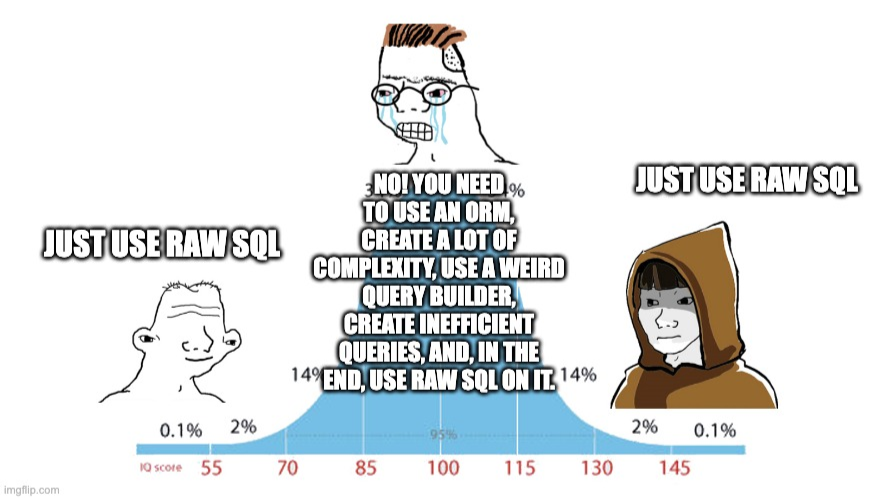

# **Руководство по запуску проекта ;)**

Ниже описано 5 пунктов по запуску проекта
1. [Установка проекта](#установка-проекта)
2. [SECRET_KEY](#secret_key)
3. [База данных](#база-данных)
4. [Запуск](#запуск)
5. [Функциональные оссобености](#функциональные-оссобености)\
\


## **Установка проекта**

Скачивать проект надо с моего git-репозитория, вот как это делается:
1. Открываем терминал(*'Win + R' и пишем в окошко 'cmd'*) и при помощи команд двигаемся к папке куда будем скачаивать проект
```
pwd             <-- выводит текущую директорию
ls -al          <-- выводит ВСЕ файлы и папки в текущей директории
cd <path>       <-- в место '<path>' пишем путь к папке(глобальный или отнасительно текущей директории)
mkdir <name>    <-- в место '<name>' пишем название папки каторую хотим создать
```
2. Как-то так мы оказываемся в папке куда будем скачивать проект, теперь нужно скачать сам репозиторий
```
git clone https://github.com/AlesBoyarevich/COLLEGE_SCHEULE.git
```
3. Теперь создадим виртуальное окружение, чтоб не мешать библиотеки проекта в глобальном пространстве и активируем его\
\
**ОЧЕНЬ ВАЖНО!**\
\
**Проект сделан на Django 5.2**\
**Django официально не рекамендует использовать Python выше 3.13 и ниже 3.9 для этой версии**\
**Рекомендую прислушаться к этим требованиям так как никто не может гарантировать работоспособность на других версиях**\
**Лично я использовал Python 3.10 для разработки**\
\
**К чему это все**\
**При создании виртуального окружения, проект будет иметь такю же версию python, что и python при создании окружения**\
\
Версию python можно проверить командой ниже
```
Python -V
```
Поэтому разбираемся с 'питонами' и создаем окружение на нужной версии python
```
python -m venv .venv
source .venv/Scripts/activate
```

4. Теперь наконец-то можно скачать зависимости

```
pip install -r requitements.txt
```
\


## **SECRET_KEY**

SECRET_KEY - это очень интересная истоия. Для тех кто не в курсе, он используются для шифрования информации о сеансе\
Поэтому эту штуку надо очень чательно беречь, прятать и желательно не менять без необходимости\
Ну естествено я не положил вам в комплекте со своим проектам SECRET_KEY :)\
Поэтому у вас 2 пути:
* Взять где-то свой SECRET_KEY и подставить его в переменную TOKEN (./COLLEGE_SCHEDULE/secrets.py)
* Или сказать мне спасибо за то, что я сделал его авто-генерируемым при значении None\
Изначально TOKEN=None, поэтому при первом запуске сгенерируется новый secret key и подсунется в переменную TOKEN (навсегда)\
\


## **База данных**

Создадим таблицы бд
```
python manage.py migrate
```
\


## **Запуск**

Торжествно объявляю, что ваши мучения закончились!\
Можно запускасть
```
python manage.py runserver
```

## **Функциональные оссобености**

* Для создания редактирования данных нужно зареистрироваться.
* Для фильтрации расписания по группе нужно нажать на номер группы в любой из таблиц.
* Для редактирования записи расписания нужно нажать на нее в таблице.
* Модель преподавателей и расписания была чуть-чуть усложнена.
\
\
**ВАЖНО!!!**\
при создании сайта ни одна нейронка не была потревожена\
все было вывезено на гуле и чистом скиле
## **~~Нейросети — это костыли для тех, кто не умеет писать код.~~ Я вполне адекватно отношусь к нейросетям в разработке :)**
\
